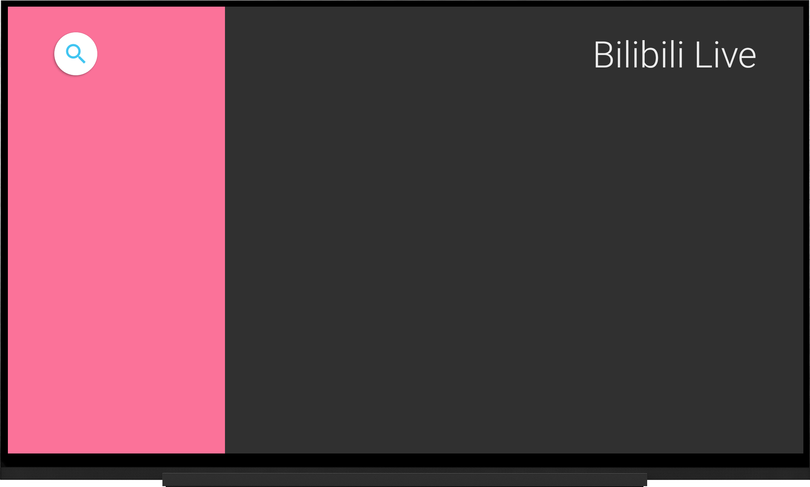
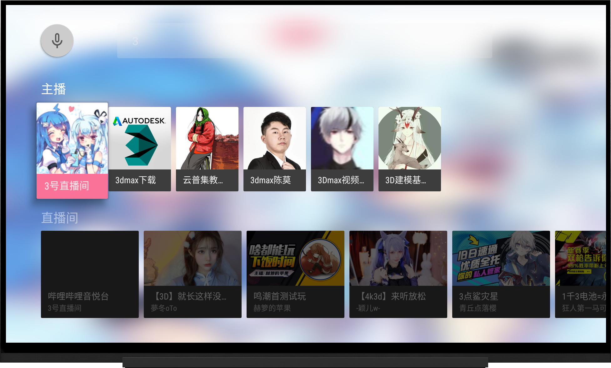
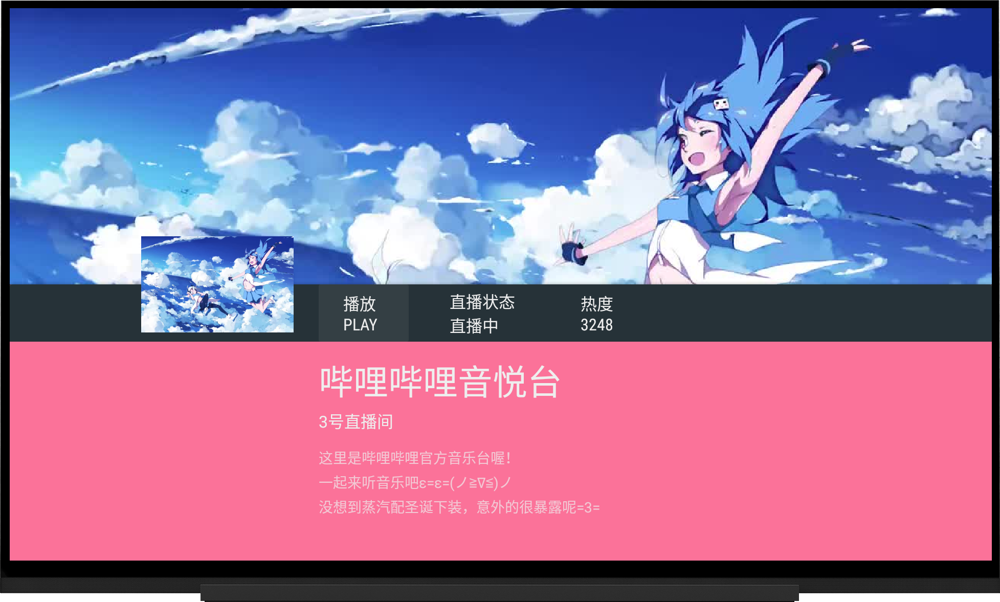
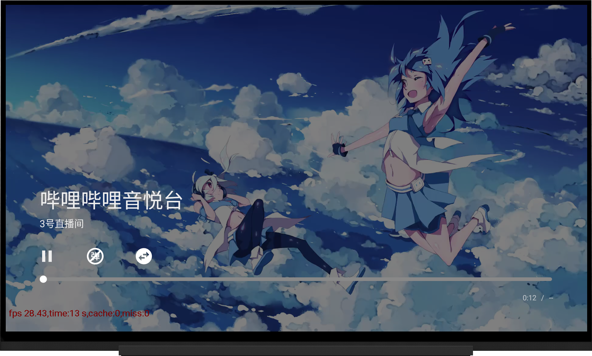
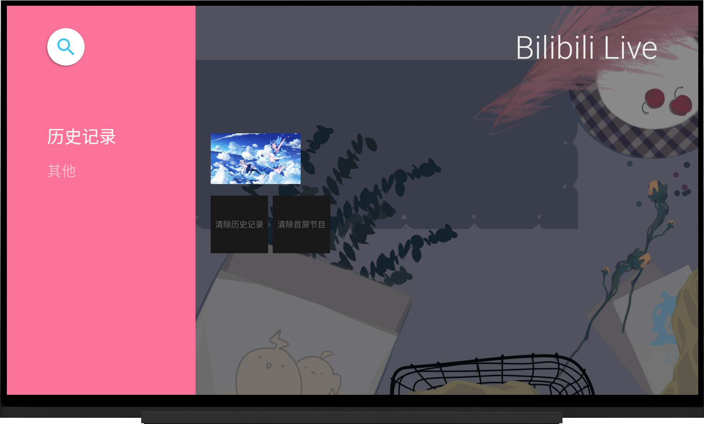
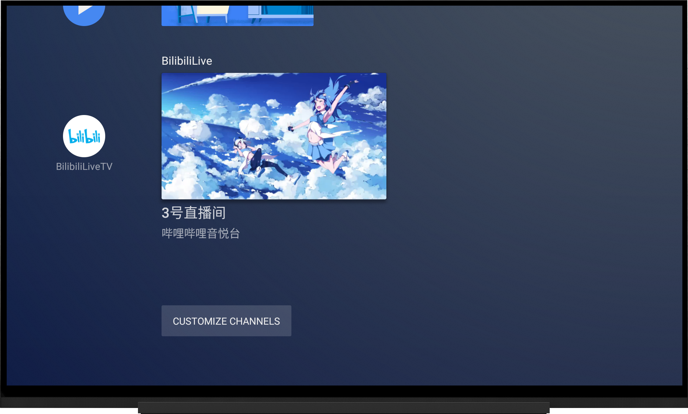
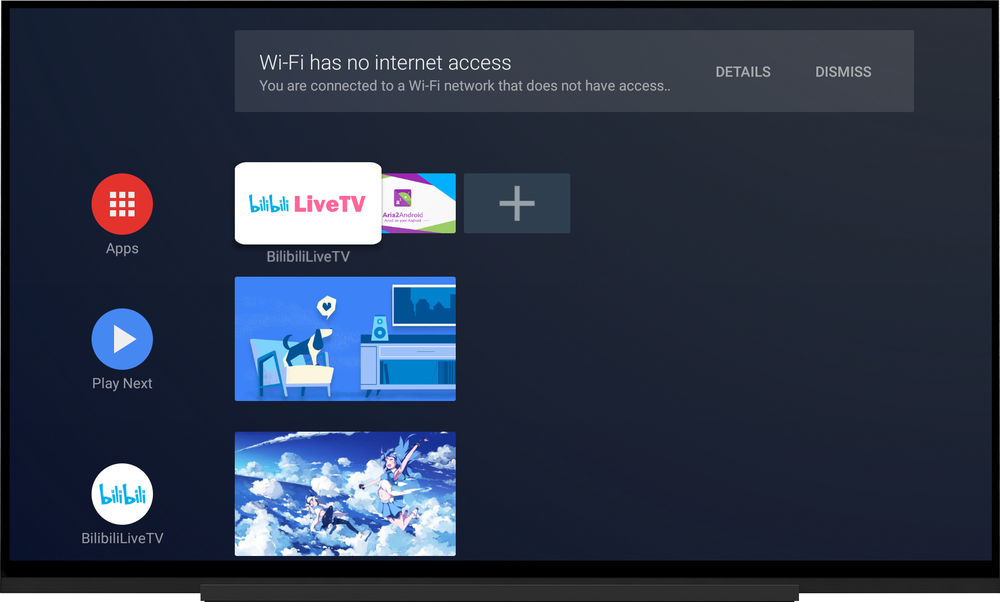

# BilibiliLiveTV  

  
[Leanback](https://developer.android.google.cn/training/tv/start/start#tv-libraries) + [ExoPlayer](https://github.com/google/ExoPlayer) + [DanmakuFlameMaster](https://github.com/bilibili/DanmakuFlameMaster)
## Usage

